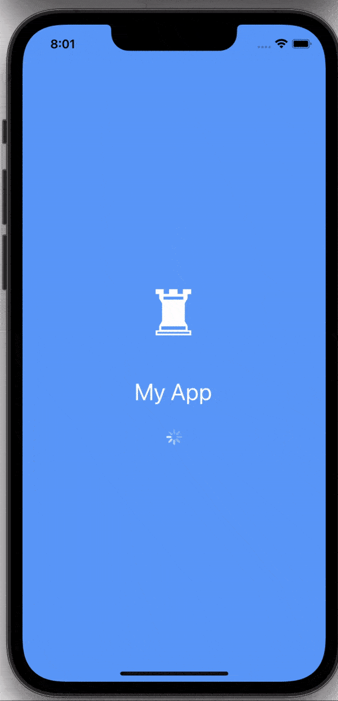

# Startup Task Sequence Sample

## Blog posts
- **Part. 1** - How to build a task sequence  https://www.xamboy.com/2022/03/26/building-a-task-sequence-in-xamarin-forms-maui-part-1/

- **Part. 2** - Start in a specific task, skip tasks, conditional tasks and passing parameters.      
https://www.xamboy.com/2022/03/26/building-a-task-sequence-in-xamarin-forms-maui-part-2/

- **Part. 3** - Pending 
